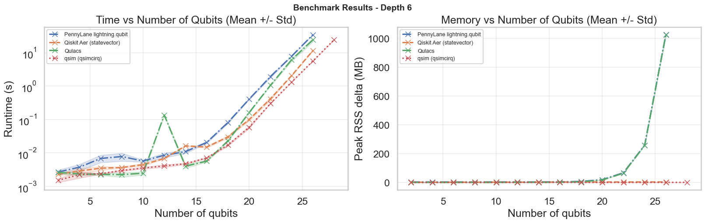

# Benchmarking Classical Quantum Circuit Simulators

Benchmarks of four CPU-based exact state-vector simulators on a representative
variational quantum circuit (VQC) workload, comparing runtime and peak memory as
qubit count and circuit depth grow.

**Backends compared**

| Backend | Framework | Version |
|---|---|---|
| Qiskit Aer (`statevector`) | Qiskit | qiskit 2.4.0 / qiskit-aer 0.17.2 |
| `lightning.qubit` | PennyLane | pennylane 0.44.1 / pennylane-lightning 0.44.0 |
| Qulacs | Qulacs | 0.6.13 |
| qsim (`qsimcirq`) | Cirq | qsimcirq 0.22.0 / cirq-core 1.6.1 |

These were selected because they all support CPU-based exact state-vector
simulation, are relevant to parametric/VQC workloads, span the major quantum
software ecosystems, and are mature enough for a meaningful comparison.

## Methodology (summary)

- **Circuit family:** layered VQC — `RY(θ)` and `RZ(φ)` on every qubit per layer,
  followed by a ring of CNOTs (periodic boundary).
- **Sweep:** qubits `q ∈ {2, 4, …, 28}`, depths `d ∈ {2, 4, 6}`.
- **Fairness controls:** identical circuits and seeded parameters across backends,
  exact state-vector mode everywhere (`shots=None`), constant-size observable
  output (`⟨Z₀⟩`) to avoid backend-dependent output overhead, one untimed warm-up
  run, five timed repeats (mean ± std reported), 60 s per-run timeout.
- **Memory:** each timed run executes in a fresh subprocess; peak RSS minus
  baseline is reported, avoiding allocator-reuse effects that hide scaling trends
  in long-lived processes.

Full implementation details are in the notebook; the accompanying
[report](backend_recommendation_report.pdf) gives the complete discussion and
backend recommendation.

## Key findings

- **Qubit count dominates runtime**; depth acts as a secondary scaling factor.
- **qsim (qsimcirq) is the strongest backend overall** — fastest in the
  fast-iteration regime (q ≤ 10), the only backend fully reliable in the
  high-qubit regime (q ≥ 20), and among the most memory-favorable.
- **Qiskit Aer** is the strongest secondary option — competitive and scalable,
  a good fallback where Qiskit ecosystem compatibility matters.
- **Qulacs** is competitive at small sizes but shows the earliest memory
  pressure at larger qubit counts.
- **PennyLane `lightning.qubit`** is consistently slower and less scalable in
  this CPU-only exact-simulation setting.



## Repository contents

| Path | Description |
|---|---|
| `benchmarking_classical_simulators.ipynb` | Main notebook: benchmark harness, plots, and analysis |
| `backend_recommendation_report.pdf` | Short write-up with methodology, results, and recommendation |
| `benchmark_outputs/` | Saved results (`raw_results.csv` plus mean/std runtime and memory tables) |
| `figs/` | Runtime/memory vs. qubit plots at each depth |

The analysis and plotting cells load from `benchmark_outputs/*.csv`, so the
notebook can be explored without re-running the (long) benchmark sweep.

## Reproducing the benchmarks

Tested with Python 3.12.

```bash
python -m venv .venv
# Windows: .venv\Scripts\activate    |    macOS/Linux: source .venv/bin/activate
pip install -r requirements.txt
jupyter lab benchmarking_classical_simulators.ipynb
```

Run the notebook top to bottom. The benchmark sweep cell re-runs all backends
(each measurement in a fresh subprocess) and overwrites `benchmark_outputs/`;
the sweep parameters (`QUBIT_COUNTS`, `DEPTHS`, `REPEATS`, `MAX_SECONDS_PER_RUN`)
can be reduced in the configuration cell for a quicker pass.

## Limitations

CPU-only, exact state-vector simulators only — conclusions do not directly
extend to GPU-enabled or tensor-network backends. Memory is process-level peak
RSS delta, which is practical for comparison but may not fully capture
allocator-level or backend-internal usage.
